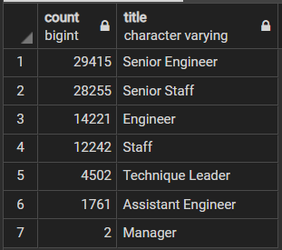
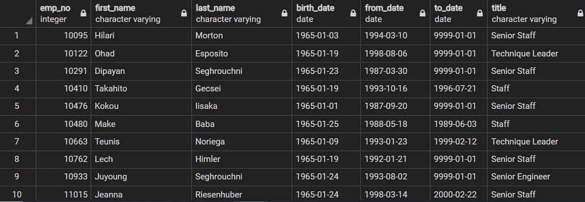

# Pewlett-Hackard-Analysis

## Analysis Overview
The purpose of this analysis was to first evaluate which employees were nearing retirement, and from there narrowing our view to understand which job titles will be most impacted by the upcoming expected retirements (see image below).

 


From here, we begin to narrow our search to best understand which employees are eligible for mentorship programs related to potential upcooming retirements.

 

## Results of Analysis
Evaluating the retirement information that we queried, the following information is of note:

* Approximately 90,400 employees are approaching retirement age
  
* Senior Engineer and Senior Staff positions will be hit hardest - with a majority of expected retirees coming from those two titles.
    
* 1,940 employees are mentorship eligible and ready to begin the program if interested in retirement.

* If the data hadn't been analyzed before running queries, we'd have ended up potentially believing over 133,000 employees are near retirement, as the files contained duplicate employee numbers for those who have changed positions.

---

## Summary 
* What is the average age by department that employees retire?

* What are our future position needs based on project planning so we can best understand recruiting/hiring efforts to manage the upcoming expected turnover?

```bash
Kyle Schneider, 10/18/2020
```
